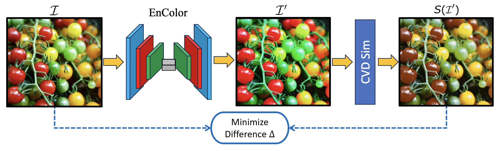

# EnColor Experiment



## Overview

**EnColor: Improving Visual Accessibility with a Deep Encoder-Decoder Image Corrector for Color Vision Deficient Individuals**

**Authors:** Satyam Goyal, Kavya Sasikumar, Rohan Sheth, Akash Seelam, Taeyeong Choi, and Xin Liu

**Institutions:**

- University of Michigan, Ann Arbor, MI, USA
- University of California, Davis, CA, USA
- Kennesaw State University, Marietta, GA, USA

**Contact Emails:** sagoyal@umich.edu

## Abstract

EnColor is a deep encoder-decoder image corrector designed to help individuals with color vision deficiencies (CVDs) perceive images as intended. By incorporating a CVD simulator into our training pipeline, EnColor ensures that output images maintain their color fidelity when viewed by individuals with CVDs. Our method significantly improves color retention over previous algorithms and has been validated through both quantitative metrics and participant surveys.

## Repository Structure

- `data_gather/laboro_tomato`
  - `annotations/`
  - `test/`
  - `test_downsized/`
  - `train/`
  - `data_download.ipynb`
  - `data_downsize.ipynb`
- `encolor`
  - `cnn.ipynb`
  - `linear_regression.ipynb`
- `previous_exp`
  - `color_exp/`
  - `daltonizer/`
- `results/`
- `simulation`
  - `linear_simulation_data.json`
  - `simulation.ipynb`

## Pipeline Description

EnColor uses a deep convolutional encoder-decoder architecture to transform images into versions that retain their original color information for individuals with CVDs. The pipeline is as follows:

1. **Input Image (I):** The original image.
2. **EnColor Encoder-Decoder Network:** Transforms the input image into a color-corrected version (I').
3. **CVD Simulator:** Simulates the color vision deficiency on the corrected image (S(I')).
4. **Loss Calculation:** Computes the difference (∆) between the original image (I) and the simulated corrected image (S(I')), and minimizes this difference.

## How to Use

1. **Clone the Repository:**

   ```bash
   git clone https://github.com/Satgoy152/EnColorExperiments.git
   cd EnColorExperiments
   ```
2. **Install Dependencies:**

   ```bash
   pip install -r requirements.txt
   ```
3. **Data Preparation:**

   - Download and downsize the dataset using the provided notebooks in `data_gather/laboro_tomato`.
4. **Model Training:**

   - Train the model using the notebooks in `encolor`.
5. **Simulation:**

   - Use the `simulation.ipynb` notebook to apply the CVD simulator and evaluate the performance.

## Results and Evaluation

The EnColor model outperforms baseline methods by achieving higher color retention and better subjective scores from user surveys. Quantitative evaluations show over 16.8% improvement in color retention compared to previous methods.

## Contributions

We welcome contributions from the community. Please follow the standard fork-and-pull request workflow:

1. Fork the repository.
2. Create a new branch for your feature or bug fix.
3. Commit your changes.
4. Push to your fork.
5. Create a pull request with a detailed description of your changes.

## License

This project is licensed under the MIT License. See the `LICENSE` file for more details.

## Acknowledgments

We thank all participants who took part in our surveys and provided valuable feedback for improving the EnColor model.

## Contact

For any questions or inquiries, please reach out to the authors via the provided email addresses.

---

This README provides a comprehensive guide to the EnColor project, including its purpose, usage instructions, and repository structure. For further details, please refer to the accompanying paper and supplementary materials.
